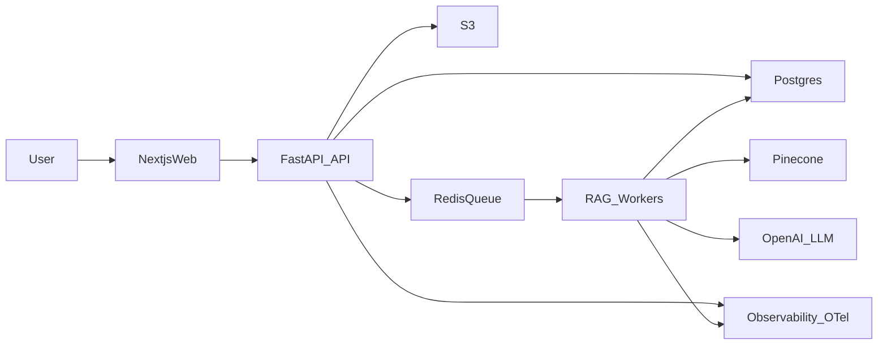

# Smart IELTS Mentor – Kế hoạch End-to-End (Production-ready, scalable)

## Mục tiêu sản phẩm (definition of done)

- **Chức năng lõi**: người dùng nộp Writing (text) hoặc Speaking (audio) → hệ thống trả **band score tổng + 4 tiêu chí** (TR/CC/LR/GRA) + nhận xét “khắt khe” + danh sách lỗi & cách sửa + bài tham chiếu tương tự.
- **Trải nghiệm người dùng thật**: đăng nhập, lịch sử bài làm, trạng thái xử lý (job), quota/rate limit, thanh toán (tùy chọn).
- **Production ready**: quan sát hệ thống (logs/metrics/traces), bảo mật, kiểm soát chi phí LLM, test + eval, deploy/rollback.
- **Scalable**: API stateless + hàng đợi worker; vector DB managed.

## Lựa chọn mặc định (có thể đổi sau)

- **LLM**: OpenAI (ví dụ GPT-4o) cho chấm/feedback.
- **Embeddings**: OpenAI embeddings (ví dụ `text-embedding-3-large` hoặc tương đương).
- **RAG framework**: LlamaIndex cho ingestion/retrieval; (tùy chọn) LangChain cho agent/tooling.
- **Vector DB**: Pinecone (managed, dễ vận hành). (Nhánh thay thế: Milvus khi cần tự host/giảm chi phí.)
- **Backend**: FastAPI async.
- **Async jobs**: Celery + Redis (queue) hoặc Redis Queue tương đương.
- **App DB**: Postgres (user, submissions, billing, audit).
- **Object storage**: S3 (audio uploads, artifacts).
- **Frontend**: Next.js (web cho real users). (Có thể thêm Streamlit chỉ cho nội bộ demo.)
- **Deploy**: Docker trên AWS EC2 (ngắn hạn), nâng lên ECS/ASG khi scale.

## Kiến trúc mục tiêu

## Cấu trúc repo đề xuất

- `[backend/](backend/)`
  - `[backend/app/main.py](backend/app/main.py)` (FastAPI)
  - `[backend/app/api/](backend/app/api/)` (routes)
  - `[backend/app/services/](backend/app/services/)` (RAG, scoring, audio)
  - `[backend/app/workers/](backend/app/workers/)` (Celery tasks)
  - `[backend/app/db/](backend/app/db/)` (SQLAlchemy/Alembic)
  - `[backend/app/core/config.py](backend/app/core/config.py)` (env/config)
- `[rag/](rag/)`
  - `[rag/ingest/](rag/ingest/)` (pipelines)
  - `[rag/retrieval/](rag/retrieval/)` (query & rerank)
  - `[rag/prompts/](rag/prompts/)` (system prompts, schemas)
  - `[rag/eval/](rag/eval/)` (offline eval)
- `[frontend/](frontend/)` (Next.js)
- `[infra/](infra/)`
  - `[infra/docker/](infra/docker/)` (Dockerfiles, compose)
  - `[infra/nginx/](infra/nginx/)` (reverse proxy)
  - `[infra/ci/](infra/ci/)` (pipelines)

## Milestones (MVP → Beta → Production)

### Milestone 0: Product spec + rubric schema (1–3 ngày)

- Chốt **output schema** (JSON) cho:
  - band tổng + 4 tiêu chí
  - danh sách lỗi (type, vị trí, severity, sửa)
  - gợi ý cải thiện (prioritized)
  - bằng chứng trích dẫn từ rubric + bài mẫu (RAG citations)
- Chuẩn hóa **taxonomy lỗi** (grammar, coherence, vocab, task response, pronunciation/fluency...).

### Milestone 1: Data ingestion + vector index (3–7 ngày)

- Thu thập & chuẩn hóa dữ liệu:
  - Band Descriptors (official/public) → phân đoạn theo tiêu chí/band.
  - 1000+ bài mẫu band 8+ (kèm metadata: task type, topic, band, highlights).
- Thiết kế schema metadata cho vector:
  - `source_type` (descriptor/sample/error_pattern)
  - `skill` (writing_task1/writing_task2/speaking_part1/2/3)
  - `criterion` (TR/CC/LR/GRA)
  - `band`, `topic`, `task_id`, `lang`, `created_at`
- Pipeline ingestion:
  - cleaning, dedup, chunking (theo đoạn/ý, tránh chunk quá dài)
  - embedding + upsert Pinecone
  - kiểm tra chất lượng (coverage, chunk size distribution, duplicates)

### Milestone 2: RAG core + scoring engine (5–10 ngày)

- Xây dựng retrieval đa tầng:
  - Stage A: query rewrite (theo task, tiêu chí, lỗi)
  - Stage B: retrieve topK từ Pinecone (kèm filters)
  - Stage C: rerank (LLM-based hoặc cross-encoder nếu cần)
  - Stage D: evidence selection (cắt trích câu liên quan)
- Thiết kế prompt “giám khảo khắt khe”:
  - ràng buộc rubric, yêu cầu **evidence-based**
  - output JSON hợp lệ; retry với deterministic repair khi parse fail
  - chống prompt injection (tách system/user, sanitize, refuse tool leakage)
- Scoring logic:
  - Chấm từng tiêu chí → band + justification + actionable fixes
  - Hợp nhất thành band tổng (quy tắc làm tròn/biên)
  - Tạo “study plan” (ưu tiên 3 lỗi ảnh hưởng band nhiều nhất)

### Milestone 3: Speaking pipeline (ASR + feedback) (5–10 ngày)

- Upload audio → lưu S3 → job xử lý.
- ASR (OpenAI hoặc dịch vụ tương đương) + timestamps.
- Phân tích theo Fluency/Pronunciation/LR/GRA + coherence.
- RAG theo lỗi tương tự (phát âm/nhịp nói/collocations) + mẫu trả lời.

### Milestone 4: Backend API async + persistence (5–10 ngày)

- FastAPI endpoints:
  - `POST /submissions/writing` (text)
  - `POST /submissions/speaking` (audio)
  - `GET /jobs/{id}` (status/progress)
  - `GET /submissions/{id}` (result)
- Hàng đợi worker:
  - idempotency key, retries, dead-letter strategy
  - progress events (db + optional websocket)
- Postgres schema:
  - users, submissions, jobs, usage, prompts_versions, eval_runs
- Rate limiting + quota + usage tracking theo user.

### Milestone 5: Frontend (Next.js) cho người dùng thật (5–12 ngày)

- Auth (email/password hoặc OAuth) + session.
- UI nộp bài + theo dõi trạng thái job.
- Trang kết quả: highlight lỗi, rubric breakdown, “before/after”, references.
- Dashboard lịch sử + export PDF.

### Milestone 6: Reliability, cost control, observability (song song, bắt buộc trước public beta)

- Observability:
  - structured logging (request_id/job_id/user_id)
  - OpenTelemetry traces (API → worker → OpenAI/Pinecone)
  - metrics: latency p95, job time, error rate, token usage, cost/day
- Guardrails:
  - input limits (max words/audio length)
  - timeout budgets theo stage, circuit breaker khi OpenAI lỗi
  - caching embeddings & retrieval theo hash nội dung
  - prompt/versioning + rollback
- Security:
  - secrets management (env + AWS SSM/Secrets Manager)
  - encryption at rest (S3, Postgres)
  - PII policy + data retention + user delete

### Milestone 7: CI/CD + Docker deploy AWS EC2 (3–7 ngày)

- Dockerization:
  - `backend` image, `worker` image, `frontend` image
  - docker-compose cho local dev + staging
- CI:
  - lint/typecheck/tests + build images
  - migration checks
- CD (EC2):
  - reverse proxy (Nginx), TLS (Let’s Encrypt hoặc ALB/ACM)
  - blue/green hoặc rolling restart
  - health checks + automated rollback

### Milestone 8: Evaluation harness + human-in-the-loop (liên tục)

- Offline eval:
  - tập essay/audio có “gold-ish” band & lỗi (từ dữ liệu mẫu + human review)
  - metrics: rubric consistency, factuality vs evidence, helpfulness
- Online A/B:
  - prompt versions, retrieval params, topK
- Admin tooling:
  - review queue, flag outputs, user feedback loop

## Danh sách task chi tiết (ưu tiên triển khai)

- **proj-setup**: Khởi tạo monorepo, env management, code style, pre-commit.
- **data-schema**: Chuẩn hóa format dữ liệu nguồn + metadata vector.
- **ingest-pipeline**: ETL + chunking + embeddings + upsert Pinecone.
- **retrieval-v1**: Query rewrite + retrieve + rerank + evidence selection.
- **scoring-v1-writing**: Prompt + JSON schema + parser/retry + band aggregation.
- **api-v1**: FastAPI endpoints + auth stub + job model.
- **queue-workers**: Celery/Redis + retries/idempotency + progress.
- **storage**: Postgres + Alembic migrations; S3 upload flow.
- **frontend-v1**: Next.js submit + job status + results view.
- **observability**: OTel instrumentation + logs + metrics + dashboards.
- **cost-guards**: token budgets, caching, rate limits, per-user quotas.
- **security-hardening**: secrets, encryption, retention, audit logs.
- **deploy-ec2**: Docker compose prod, Nginx, TLS, runbooks.
- **eval-suite**: offline eval runner + regression gates in CI.
- **speaking-v1**: ASR + speaking rubric + feedback UI.

## Runbook vận hành (tối thiểu)

- SLO gợi ý: API p95 < 500ms (enqueue); job writing p95 < 90s; speaking p95 < 4–6 phút.
- On-call checklist: OpenAI/Pinecone outage mode, queue backlog, db saturation.
- Backup/restore: Postgres snapshot + S3 lifecycle.

