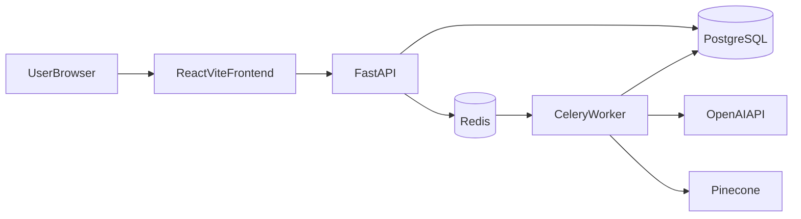
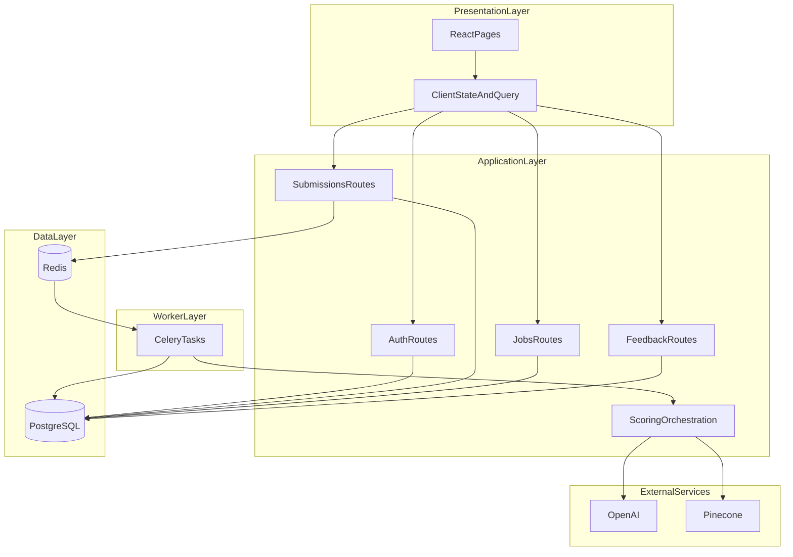
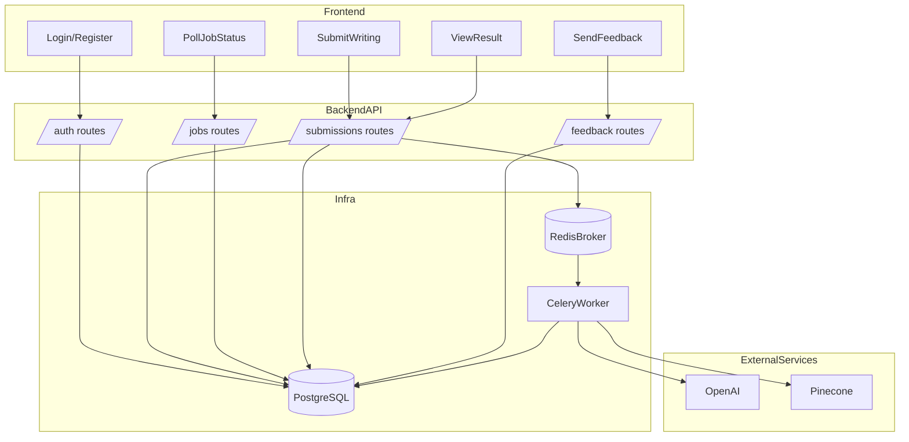

# Smart IELTS Mentor

Nền tảng AI chấm IELTS Writing Task 2 theo kiến trúc async (API + Worker), có authentication, quota, RAG scoring pipeline, và luồng phản hồi người dùng.

## 1) Tổng quan dự án

Smart IELTS Mentor giải quyết bài toán:

- Người dùng đăng ký/đăng nhập
- Nộp bài Writing Task 2
- Hệ thống đưa bài vào hàng đợi xử lý (không block request)
- Worker chấm điểm bằng pipeline RAG 2 phase
- Người dùng theo dõi trạng thái job và xem kết quả chi tiết
- Người dùng gửi feedback để cải thiện hệ thống

Mục tiêu kiến trúc là giữ API phản hồi nhanh, tách xử lý nặng (LLM scoring) sang worker để tăng độ ổn định.

## 2) Framework và công nghệ sử dụng

### Backend

- `FastAPI`: xây REST API
- `SQLAlchemy` (async + sync): ORM và truy cập DB
- `Alembic`: quản lý migration schema
- `PostgreSQL`: lưu users, submissions, jobs, assessment results, usage, feedback
- `Celery + Redis`: queue và background worker
- `Pydantic v2`: schema/validation/settings
- `python-jose`, `passlib`: JWT + hashing password
- `OpenAI SDK`: LLM scoring và embeddings
- `Pinecone SDK`: retrieval dữ liệu phase 2
- `structlog`, `Sentry`: logging và theo dõi lỗi

### Frontend

- `React + Vite + TypeScript`
- `TanStack Query`, `React Router`, `React Hook Form`, `Zod`

### Hạ tầng local

- `Docker Compose`
- `Nginx` (serve frontend build)
- `MinIO` (tuỳ chọn, mô phỏng S3)

## 3) Kiến trúc tổng quát



## 4) Kiến trúc chi tiết theo tầng



## 5) Luồng xử lý Writing end-to-end

```mermaid
flowchart TD
  A[POST /api/v1/submissions/writing] --> B[CreateSubmissionAndJobQueued]
  B --> C[EnqueueCeleryTask]
  C --> D[WorkerSetJobRunning]
  D --> E[RAGPhase1AndPhase2Scoring]
  E --> F[PersistAssessmentResult]
  F --> G[JobSucceededOrFailed]
  G --> H[GET /api/v1/jobs/{job_id}]
  H --> I[GET /api/v1/submissions/{submission_id}]
  I --> J[POST /api/v1/feedback]
```

## 6) Clone và cài đặt

### 6.1 Clone source

```bash
git clone https://github.com/<your-org-or-user>/Smart_IELTS_Mentor.git
cd Smart_IELTS_Mentor
```

### 6.2 Chuẩn bị biến môi trường

Tạo file `.env` ở project root. Các nhóm quan trọng:

- Auth: `JWT_SECRET`, `JWT_ISSUER`, `JWT_AUDIENCE`
- DB: `POSTGRES_HOST`, `POSTGRES_PORT`, `POSTGRES_DB`, `POSTGRES_USER`, `POSTGRES_PASSWORD`
- Queue: `REDIS_URL`
- LLM/RAG: `OPENAI_API_KEY`, `PINECONE_API_KEY`, `PINECONE_INDEX_NAME`, `PINECONE_NAMESPACE`
- CORS: `CORS_ALLOWED_ORIGINS`

Lưu ý khi chạy local host (không chạy API trong container):

- `POSTGRES_HOST=localhost`
- `POSTGRES_PORT=5433` (theo mapping compose)
- `REDIS_URL=redis://localhost:6379/0`

## 7) Chạy dự án bằng Docker Compose (khuyến nghị)

### 7.1 Build + start

```bash
docker compose up -d --build
```

Dịch vụ chính:

- `postgres`
- `redis`
- `api`
- `worker`
- `frontend`

MinIO (optional):

```bash
docker compose --profile s3 up -d --build
```

### 7.2 Kiểm tra trạng thái

```bash
docker compose ps
```

### 7.3 Xem logs

```bash
docker compose logs -f api
docker compose logs -f worker
docker compose logs -f frontend
```

## 8) Chạy thủ công (phù hợp debug)

### 8.1 Chạy Postgres + Redis bằng Docker

```bash
docker compose up -d postgres redis
```

### 8.2 Chạy API

```bash
cd backend
python3 -m venv .venv
source .venv/bin/activate
python -m pip install -r requirements.txt
PYTHONPATH=".:.." alembic upgrade head
PYTHONPATH=".:.." uvicorn app.main:app --reload --host 0.0.0.0 --port 8000
```

### 8.3 Chạy Worker

```bash
cd backend
source .venv/bin/activate
PYTHONPATH=".:.." celery -A app.workers.celery_app worker -l info -c 2
```

### 8.4 Chạy Frontend

```bash
cd frontend
cp .env.example .env
npm install
npm run dev
```

## 9) Endpoint chính

- `GET /health`
- `POST /api/v1/auth/register`
- `POST /api/v1/auth/login`
- `POST /api/v1/auth/refresh`
- `POST /api/v1/auth/logout`
- `POST /api/v1/submissions/writing`
- `GET /api/v1/jobs/{job_id}`
- `GET /api/v1/submissions/{submission_id}`
- `POST /api/v1/feedback`

## 10) Checklist verify nhanh

### Backend

```bash
cd backend
python3 -m py_compile app/main.py
```

### Frontend

```bash
cd frontend
npm run lint
npm run test
npm run build
```

## 11) Ghi chú vận hành

- Không commit `.env` chứa secret thật.
- Nếu job bị `queued` lâu: kiểm tra `worker` và `redis`.
- Nếu job `failed`: kiểm tra `jobs.error_message` và logs của worker.
- Nếu lỗi CORS: kiểm tra `CORS_ALLOWED_ORIGINS`.
- Production nên dùng managed Postgres/Redis + secret manager + CI/CD staged deploy.
# Smart IELTS Mentor

Full-stack AI application for IELTS Writing Task 2 assessment with asynchronous scoring, structured feedback, and user learning workflow.

## 1. Project Overview

Smart IELTS Mentor provides:

- JWT authentication (access + refresh + revoke)
- Writing submission API
- Async scoring pipeline via Celery worker
- RAG-based evidence-driven IELTS scoring
- Result retrieval and user feedback endpoints
- React + Vite frontend for end-to-end UX

The system separates request handling (FastAPI) and long-running LLM scoring (Celery) to keep API responses fast and resilient.

## 2. Tech Stack and Frameworks

### Backend

- **FastAPI**: REST API
- **SQLAlchemy (async + sync)**: ORM/data access
- **PostgreSQL**: primary data store
- **Alembic**: schema migrations
- **Celery + Redis**: background jobs and queue
- **Pydantic v2**: validation/settings
- **python-jose + passlib**: auth/security
- **OpenAI SDK**: LLM scoring/embeddings
- **Pinecone SDK**: vector retrieval (phase 2 evidence)
- **Structlog + Sentry**: observability

### Frontend

- **React + Vite + TypeScript**
- **React Router**
- **TanStack Query**
- **React Hook Form + Zod**
- **Vitest + Testing Library**

### Infrastructure

- **Docker Compose**
- **Nginx** (frontend static serving)
- **MinIO** (optional local S3-compatible object storage)

## 3. High-Level Architecture


## 4. Detailed Runtime Architecture



## 5. End-to-End Writing Flow

```mermaid
flowchart TD
  A[POST /api/v1/submissions/writing] --> B[Create Submission + Job queued]
  B --> C[Enqueue Celery task]
  C --> D[Worker sets Job running]
  D --> E[Run RAG scoring pipeline]
  E --> F[Store assessment_results]
  F --> G[Set Job succeeded]
  G --> H[GET /api/v1/jobs/{job_id}]
  H --> I[GET /api/v1/submissions/{submission_id}]
  I --> J[POST /api/v1/feedback]
```

## 6. Repository Structure

```text
Smart_IELTS_Mentor/
  backend/                 # FastAPI app, workers, schemas, DB models, migrations
  frontend/                # React + Vite app
  rag/                     # Prompt/evidence and RAG assets
  data/                    # Processed descriptors and other data
  docker-compose.yml       # Local stack (api, worker, db, redis, frontend, optional minio)
  .env                     # Local environment variables (do not commit)
```

## 7. Clone and Setup

### 7.1 Clone

```bash
git clone https://github.com/<your-org-or-user>/Smart_IELTS_Mentor.git
cd Smart_IELTS_Mentor
```

### 7.2 Configure Environment

Create `.env` in project root (or copy from your internal template). Required groups:

- Core/Auth (`APP_ENV`, `JWT_*`)
- Postgres (`POSTGRES_*`)
- Redis (`REDIS_URL`)
- LLM/RAG (`OPENAI_API_KEY`, `PINECONE_*`)
- CORS (`CORS_ALLOWED_ORIGINS`)

Important for local host-run API:

- `POSTGRES_HOST=localhost`
- `POSTGRES_PORT=5433` (or your mapped port)
- `REDIS_URL=redis://localhost:6379/0`

## 8. Run with Docker Compose (Recommended)

### 8.1 Build and Start

```bash
docker compose up -d --build
```

This starts:

- `postgres`
- `redis`
- `api`
- `worker`
- `frontend`

Optional MinIO:

```bash
docker compose --profile s3 up -d --build
```

### 8.2 Check Status

```bash
docker compose ps
```

### 8.3 Logs

```bash
docker compose logs -f api
docker compose logs -f worker
docker compose logs -f frontend
```

## 9. Run Manually (Without Docker for app processes)

Useful for development/debugging while still using Docker for Postgres/Redis.

### 9.1 Start Infra

```bash
docker compose up -d postgres redis
```

### 9.2 Backend API

```bash
cd backend
python3 -m venv .venv
source .venv/bin/activate
python -m pip install -r requirements.txt
PYTHONPATH=".:.." alembic upgrade head
PYTHONPATH=".:.." uvicorn app.main:app --reload --host 0.0.0.0 --port 8000
```

### 9.3 Worker

```bash
cd backend
source .venv/bin/activate
PYTHONPATH=".:.." celery -A app.workers.celery_app worker -l info -c 2
```

### 9.4 Frontend

```bash
cd frontend
cp .env.example .env
npm install
npm run dev
```

## 10. Common Endpoints

- `GET /health`
- `POST /api/v1/auth/register`
- `POST /api/v1/auth/login`
- `POST /api/v1/auth/refresh`
- `POST /api/v1/submissions/writing`
- `GET /api/v1/jobs/{job_id}`
- `GET /api/v1/submissions/{submission_id}`
- `POST /api/v1/feedback`

## 11. Validation Checklist

### Backend

```bash
cd backend
python3 -m py_compile app/main.py
```

### Frontend

```bash
cd frontend
npm run lint
npm run test
npm run build
```

## 12. Notes and Operational Guidance

- Do not commit `.env` with real secrets.
- Rotate keys if any credential was exposed.
- If `submissions/writing` stays `queued`, verify worker + redis health.
- If scoring fails, inspect `jobs.error_message` and worker logs first.
- For production, use managed Postgres/Redis, secret manager, and CI/CD with staged deploy.
# Smart IELTS Mentor - Backend

```bash
python3 -m pip install -r backend/requirements.txt
```

## Thiết lập môi trường

### 1. Cài đặt dependencies

```bash
# Cách 1: Dùng python3 -m pip (không cần venv)
python3 -m pip install -r backend/requirements.txt

# Cách 2: Trong venv (khuyến nghị)
python3 -m venv .venv
source .venv/bin/activate   # macOS/Linux
python -m pip install -r backend/requirements.txt
```

### 2. Tạo virtual environment (khuyến nghị)

```bash
cd backend
python3 -m venv .venv
source .venv/bin/activate   # macOS/Linux
# .venv\Scripts\activate    # Windows

python -m pip install -r requirements.txt
```

### 3. Chạy API server

Từ **project root** (Smart_IELTS_Mentor):

```bash
cd Smart_IELTS_Mentor
# PYTHONPATH: . = project root (rag), backend = backend (app)
PYTHONPATH=".:backend" python -m uvicorn app.main:app --reload --host 0.0.0.0 --port 8000
```

Hoặc từ **backend**:

```bash
cd backend
# PYTHONPATH: . = backend (app), .. = project root (rag)
PYTHONPATH=".:.." python -m uvicorn app.main:app --reload --host 0.0.0.0 --port 8000
```

### 4. Docker Compose (Postgres + Redis)

```bash
# Từ project root
docker compose up -d

# Chỉ Postgres + Redis (mặc định)
# Nếu lỗi "port 5432 already allocated": đổi POSTGRES_PORT=5433 trong .env
# Thêm MinIO (S3): docker compose --profile s3 up -d
```

### 5. Migration

```bash
cd backend
source ../.venv/bin/activate
PYTHONPATH=".:.." alembic upgrade head
```

### 6. Biến môi trường

Copy `.env.example` → `.env` và điền giá trị. Cần ít nhất:

- `JWT_SECRET`
- `POSTGRES_*` (dùng `localhost` khi chạy API trên host)
- `REDIS_URL`
- `OPENAI_API_KEY`, `PINECONE_*` (cho scoring)
