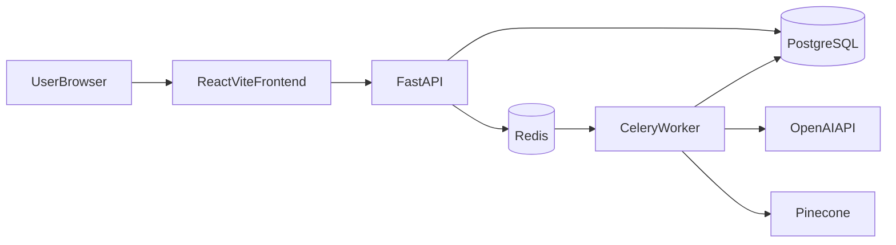
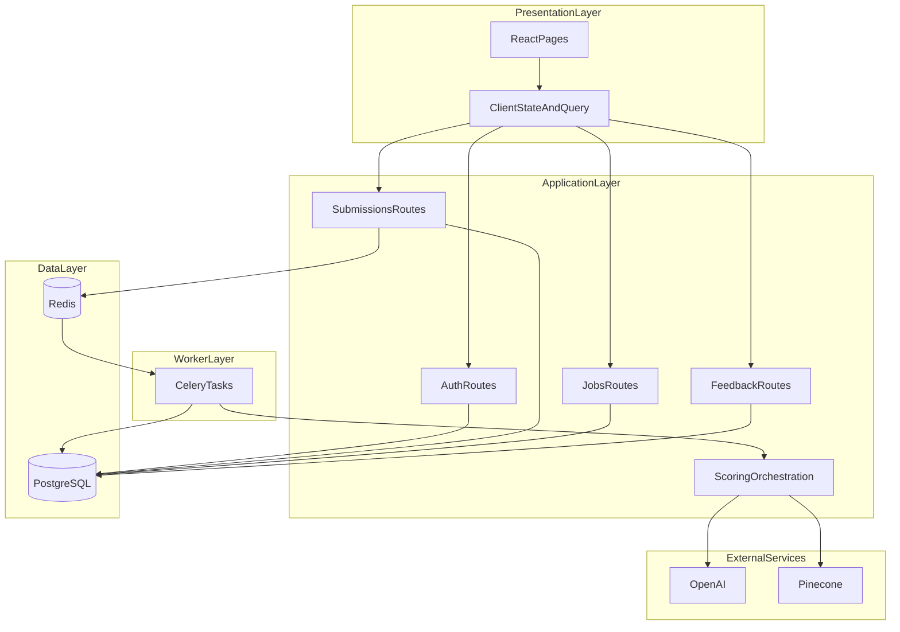
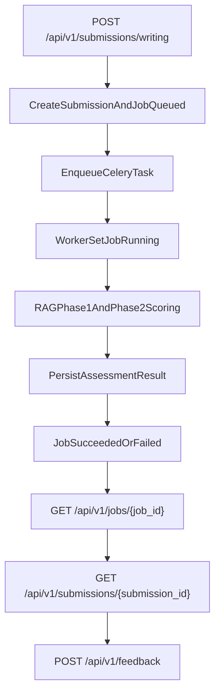

# Smart IELTS Mentor

Full-stack AI application for IELTS Writing Task 2 assessment with asynchronous scoring, structured feedback, and a user learning workflow.

---

## 1. Project Overview

Smart IELTS Mentor solves the following workflow:

- Users can register and authenticate
- Submit IELTS Writing Task 2 essays
- Requests are handled asynchronously (non-blocking API)
- Background workers process scoring using a 2-phase RAG pipeline
- Users can track job status and retrieve detailed results
- Users can submit feedback to improve the system

The architecture separates API handling and heavy LLM computation to ensure high performance and reliability.

---

## 2. Tech Stack and Frameworks

### Backend

- **FastAPI** – REST API framework  
- **SQLAlchemy (async + sync)** – ORM and data access  
- **PostgreSQL** – Primary database  
- **Alembic** – Database migrations  
- **Celery + Redis** – Task queue and background processing  
- **Pydantic v2** – Data validation and settings  
- **python-jose + passlib** – JWT authentication and password hashing  
- **OpenAI SDK** – LLM scoring and embeddings  
- **Pinecone SDK** – Vector retrieval (RAG phase 2)  
- **Structlog + Sentry** – Logging and monitoring  

### Frontend

- **React + Vite + TypeScript**
- **React Router**
- **TanStack Query**
- **React Hook Form + Zod**
- **Vitest + Testing Library**

### Infrastructure

- **Docker Compose**
- **Nginx** – Static frontend serving
- **MinIO (optional)** – S3-compatible object storage

---

## 3. High-Level Architecture



## 4. Detailed Runtime Architecture



## 5. End-to-End Writing Flow



## 6. Clone and Setup

### 6.1 Clone source

```bash
git clone https://github.com/<your-org-or-user>/Smart_IELTS_Mentor.git
cd Smart_IELTS_Mentor
```

### 6.2 Configure Environment

Create a .env file in the project root.

Required variables:

- Auth: `JWT_SECRET`, `JWT_ISSUER`, `JWT_AUDIENCE`
- DB: `POSTGRES_HOST`, `POSTGRES_PORT`, `POSTGRES_DB`, `POSTGRES_USER`, `POSTGRES_PASSWORD`
- Queue: `REDIS_URL`
- LLM/RAG: `OPENAI_API_KEY`, `PINECONE_API_KEY`, `PINECONE_INDEX_NAME`, `PINECONE_NAMESPACE`
- CORS: `CORS_ALLOWED_ORIGINS`

For local development (API running on host):

- `POSTGRES_HOST=localhost`
- `POSTGRES_PORT=5433` (theo mapping compose)
- `REDIS_URL=redis://localhost:6379/0`

## 7. Run with Docker Compose 
### 7.1 Build + start

```bash
docker compose up -d --build
```

Main services:

- `postgres`
- `redis`
- `api`
- `worker`
- `frontend`


### 7.2 Check status

```bash
docker compose ps
```

### 7.3 View Logs

```bash
docker compose logs -f api
docker compose logs -f worker
docker compose logs -f frontend
```

## 8. Run Manually (Development Mode)

### 8.1 Run Postgres + Redis with Docker

```bash
docker compose up -d postgres redis
```

### 8.2 Run API

```bash
cd backend
python3 -m venv .venv
source .venv/bin/activate
python -m pip install -r requirements.txt
PYTHONPATH=".:.." alembic upgrade head
PYTHONPATH=".:.." uvicorn app.main:app --reload --host 0.0.0.0 --port 8000
```

### 8.3 Run Worker

```bash
cd backend
source .venv/bin/activate
PYTHONPATH=".:.." celery -A app.workers.celery_app worker -l info -c 2
```

### 8.4 Run Frontend

```bash
cd frontend
cp .env.example .env
npm install
npm run dev
```

## 9) Endpoints

- `GET /health`
- `POST /api/v1/auth/register`
- `POST /api/v1/auth/login`
- `POST /api/v1/auth/refresh`
- `POST /api/v1/auth/logout`
- `POST /api/v1/submissions/writing`
- `GET /api/v1/jobs/{job_id}`
- `GET /api/v1/submissions/{submission_id}`
- `POST /api/v1/feedback`

## 10) Checklist verifying

### Backend

```bash
cd backend
python3 -m py_compile app/main.py
```

### Frontend

```bash
cd frontend
npm run lint
npm run test
npm run build
```
