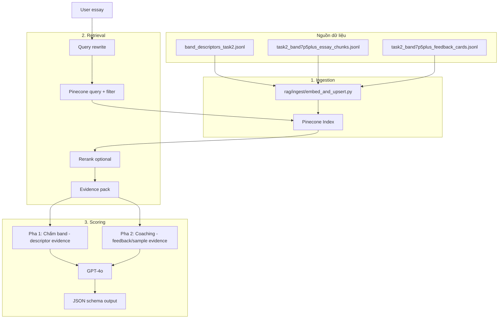

# Smart IELTS Mentor — RAG Pipeline Triển Khai

## Tổng quan luồng dữ liệu



---

## Cấu trúc module

```
rag/
├── ingest/
│   ├── __init__.py
│   ├── embed_and_upsert.py    # CLI: đọc JSONL → embed → upsert Pinecone
│   └── config.py              # paths, batch size, embedding model
├── retrieval/
│   ├── __init__.py
│   ├── client.py              # Pinecone query wrapper
│   ├── query_rewrite.py       # (optional) LLM/rule-based rewrite
│   └── evidence.py            # build evidence pack từ retrieved chunks
├── prompts/
│   ├── scoring_phase1.md      # prompt chấm band (descriptor-only)
│   ├── coaching_phase2.md     # prompt gợi ý sửa (feedback/sample)
│   └── schema.json            # JSON schema output
└── eval/
    └── run_eval.py            # offline eval (later)

backend/app/services/
├── rag/
│   └── (có thể import từ rag/ hoặc wrap gọn)
└── scoring/
    ├── writing.py             # orchestrate Pha 1 + Pha 2 → output
    └── (gọi rag.retrieval + rag.prompts + llm)
```

---

## Bước 1: Ingestion (rag/ingest/)

### 1.1 Input
- `data/processed/band_descriptors_task2.jsonl` (37 chunks, loại bỏ band 0 trống)
- `data/processed/task2_band7p5plus_essay_chunks.jsonl`
- `data/processed/task2_band7p5plus_feedback_cards.jsonl`

### 1.2 Chức năng chính
1. Đọc từng JSONL, chuẩn hoá field `text` + metadata
2. Gọi OpenAI embedding (`text-embedding-3-large`) theo batch (ví dụ 100 records/batch)
3. Upsert vào Pinecone với metadata: `source_type`, `criterion`, `band`, `task`, …
4. Báo cáo: số record thành công, lỗi (nếu có)

### 1.3 Pinecone index schema
- **Dimension**: 3072 (text-embedding-3-large) hoặc 1536 (text-embedding-3-small)
- **Metadata**: `source_type` (str), `criterion` (str), `band` (float), `task` (str), `text` (str, để trả snippet)
- **Namespace**: `default` hoặc tách `descriptor` / `sample` / `feedback` nếu cần

### 1.4 CLI
```bash
python -m rag.ingest.embed_and_upsert \
  --descriptors data/processed/band_descriptors_task2.jsonl \
  --chunks data/processed/task2_band7p5plus_essay_chunks.jsonl \
  --cards data/processed/task2_band7p5plus_feedback_cards.jsonl \
  --index smart-ielts-mentor
```

---

## Bước 2: Retrieval (rag/retrieval/)

### 2.1 Query flow
1. **Input**: `prompt` (đề bài), `essay` (bài viết)
2. **Query construction**:
   - Pha 1 (chấm band): query = "IELTS Writing Task 2 band descriptors TR CC LR GRA"
   - Filter: `source_type == "descriptor"`
   - TopK = 8–12
3. Pha 2 (coaching): query = f"essay feedback improvements for: {essay[:500]}"
   - Filter: `source_type in ["feedback_card", "essay_chunk"]`
   - TopK = 6–10

### 2.2 Rerank (optional MVP)
- Có thể bỏ qua rerank ở MVP
- Nếu thêm: dùng cross-encoder hoặc LLM relevance score

### 2.3 Evidence pack
- Gộp snippets từ retrieved chunks
- Format ngắn gọn: `[id] snippet\n` để model dễ cite

---

## Bước 3: Scoring (backend/app/services/scoring/)

### 3.1 Pha 1 — Chấm band
- **Evidence**: chỉ descriptor chunks
- **Prompt**: `rag/prompts/scoring_phase1.md`
- **Output**: `overall_band`, `criteria` (TR/CC/LR/GRA), `rubric_citations`
- **Support check**: mỗi justification phải có citation descriptor (hoặc "observed from essay")

### 3.2 Pha 2 — Coaching
- **Evidence**: feedback cards + essay chunks
- **Prompt**: `rag/prompts/coaching_phase2.md`
- **Output**: `errors`, `improvements`, `study_plan`
- **Usefulness check**: suggestions actionable

### 3.3 Merge output
- Hợp nhất 2 pha → JSON theo schema đã thiết kế
- JSON parse + retry (nếu fail)

---

## Thứ tự triển khai

| Bước | Module / File | Mô tả |
|------|---------------|-------|
| 1 | `rag/ingest/embed_and_upsert.py` | Embed + upsert Pinecone |
| 2 | `rag/retrieval/client.py` | Pinecone query + filter |
| 3 | `rag/retrieval/evidence.py` | Build evidence pack |
| 4 | `rag/prompts/scoring_phase1.md` | Prompt chấm band |
| 5 | `rag/prompts/coaching_phase2.md` | Prompt coaching |
| 6 | `backend/app/services/scoring/writing.py` | Orchestrate 2 pha + parse |
| 7 | Worker task gọi scoring | Kết nối Celery job |

---

## Biến môi trường cần có

```
OPENAI_API_KEY=
OPENAI_EMBEDDING_MODEL=text-embedding-3-large
PINECONE_API_KEY=
PINECONE_INDEX_NAME=smart-ielts-mentor
PINECONE_ENVIRONMENT=...   # ví dụ us-east1-aws
```

---

## Lưu ý MVP
- Rerank có thể bỏ qua
- Query rewrite có thể đơn giản (template query)
- Fallback: nếu Pinecone lỗi → chấm rubric-only (không evidence)
- Cache: hash(essay) → cache retrieval result (tránh tốn khi submit lại)
